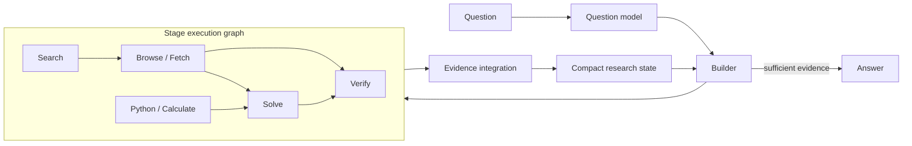

<div align="center">


<br>
<em>Research while building — dynamic execution graphs for evidence-grounded deep research</em>

[](https://www.python.org/)
[](#testing)
[](LICENSE)

[English](./README.md) | [中文文档](./README_CN.md)
<br>
[Quick Start](#quick-start) · [Architecture](#architecture) · [Web Demo](#web-demo)

</div>

<div align="center">


</div>

## Overview

Deep-research agents often lock onto an early candidate and spend the rest of their budget confirming it. Fixed pipelines have the opposite problem: every question receives the same research shape even when it needs broad discovery, multi-hop navigation, comparison, or targeted verification.

**BlockResearch builds the research process while the research is happening.** At every stage, a Builder reads the compact research state and composes a new executable graph from semantic blocks. The graph can search in parallel, follow intermediate entities, fetch primary sources, invoke specialist reasoning, verify claims, and join evidence before deciding whether to continue or answer.

> The structure of research should emerge from evidence, not be frozen before the task begins.

## Demo

<div align="center">

<video src="./static/demo.mov" controls muted width="760"></video>

[Watch the local demo video](./static/demo.mov)

</div>

The web interface streams each stage, block, dependency, query, source, and decision as the graph evolves.

## Core ideas

- **Stage-wise graph construction.** The Builder creates a fresh directed acyclic graph from the latest evidence instead of committing to a complete plan upfront.
- **Research blocks with clear roles.** Search, navigation, fetching, computation, reasoning, and verification remain independently observable and composable.
- **Evidence before confidence.** Search snippets are leads; fetched passages are durable evidence. Claims retain their exact source URLs and verification state.
- **Compact, role-aware memory.** Agents receive the candidates, decisions, evidence, and unresolved conditions they need—not an ever-growing transcript.
- **Builder as the research lead.** The Builder controls the graph and may answer directly. Solver and Verifier are optional specialists invoked only when their capabilities are useful.

## Architecture



Each stage follows a short feedback loop:

1. **Model the question** into answer type, constraints, and research needs.
2. **Build a graph** whose blocks and dependencies express the next useful investigation.
3. **Execute ready blocks concurrently** while preserving dependency outputs.
4. **Integrate results** into candidates, verified claims, source-bound passages, and open questions.
5. **Continue or answer** based on evidence coverage and marginal research value.

### Building blocks

| Block | Purpose |
|---|---|
| `SEARCH` | Discover candidate pages and intermediate entities with focused queries. |
| `BROWSE` | Navigate a known site or source neighborhood. |
| `FETCH` / `READ_PDF` | Extract decisive primary-source text and bind it to the exact URL. |
| `PYTHON` / `CALCULATE` | Perform deterministic filtering, aggregation, and calculation. |
| `SOLVE` | Provide specialist inference when the Builder requests it. |
| `VERIFY` | Test explicit claims or conditions against grounded evidence. |

### Information flow

The research state stores only high-value information: normalized candidates, concise source-bound evidence, verified or contradicted claims, unresolved conditions, and the Builder's recent decisions. Raw tool output is summarized at component boundaries. Pinned decisive evidence survives memory pruning, and a contradiction requires evidence rather than mere absence of support.

This separation matters: the Builder sees enough to direct the investigation, while optional specialists receive bounded task-specific contexts. It reduces latency and prevents a late model call from silently losing an answer that earlier stages already established.

## Quick Start

```bash
git clone git@github.com:yuanchuangspring/BlockResearch.git
cd BlockResearch
python -m venv .venv
.venv/bin/pip install -r requirements.txt
```

Create a `.env` file. BlockResearch supports two OpenAI-compatible endpoints and lets each role choose either model:

```dotenv
# Model A — economical search support and routine graph work
OPENAI_API_KEY=your_api_key
OPENAI_ENDPOINT=https://api.deepseek.com/v1
OPENAI_MODEL=deepseek-v4-flash

# Model B — stronger reasoning for important roles
NEW_API_KEY=your_second_api_key
NEW_BASE_URL=https://your-openai-compatible-endpoint/v1
NEW_MODEL=your_reasoning_model

# Optional per-role routing
DIRECTOR_MODEL=deepseek-v4-flash
SOLVER_MODEL=your_reasoning_model
VERIFIER_MODEL=your_reasoning_model
FALLBACK_SOLVER_MODEL=deepseek-v4-pro

# Web retrieval
BRAVE_API_KEY=your_brave_api_key

# Runtime controls
REASONING_EFFORT=low
LLM_TIMEOUT=120
LLM_HARD_TIMEOUT=120
```

Run a research question:

```bash
.venv/bin/python -m src.main "Which song was described in 2017 as the most beautiful piece of music?"
```

## Web Demo

```bash
.venv/bin/uvicorn src.web:app --host 0.0.0.0 --port 8000
```

Open [http://localhost:8000](http://localhost:8000). The interface provides model and role configuration, live stage updates over SSE, graph-focused execution playback, evidence inspection, and final answers.

## Project structure

```text
BlockResearch/
├── src/
│   ├── director.py     # Builder and stage-graph construction
│   ├── executor.py     # Dependency-aware graph execution
│   ├── notebook.py     # Compact research state and evidence integration
│   ├── research.py     # End-to-end research loop
│   ├── tools.py        # Search, fetch, browse, solve, and verify blocks
│   ├── llm.py          # Model routing, streaming, retries, and timeouts
│   ├── main.py         # CLI entry point
│   └── web.py          # Web API and SSE stream
├── static/             # Academic-style interactive demo and media
├── tests/              # Unit and regression tests
└── requirements.txt
```

## Evaluation

The framework is intended for web-intensive, multi-hop, and evidence-heavy benchmarks such as **BrowseComp**, **DeepSearchQA**, **WebWalkerQA**, **GAIA**, and **HLE**. Evaluation scripts and private traces are intentionally kept outside the public release; benchmark claims should be reported only from reproducible full runs.

## Testing

```bash
.venv/bin/python -m unittest discover -s tests -v
```

The current public code passes **77 unit and regression tests**, including graph validation, evidence retention, contradiction handling, retry behavior, and bounded model contexts.

## License

Released under the terms in [LICENSE](./LICENSE).
